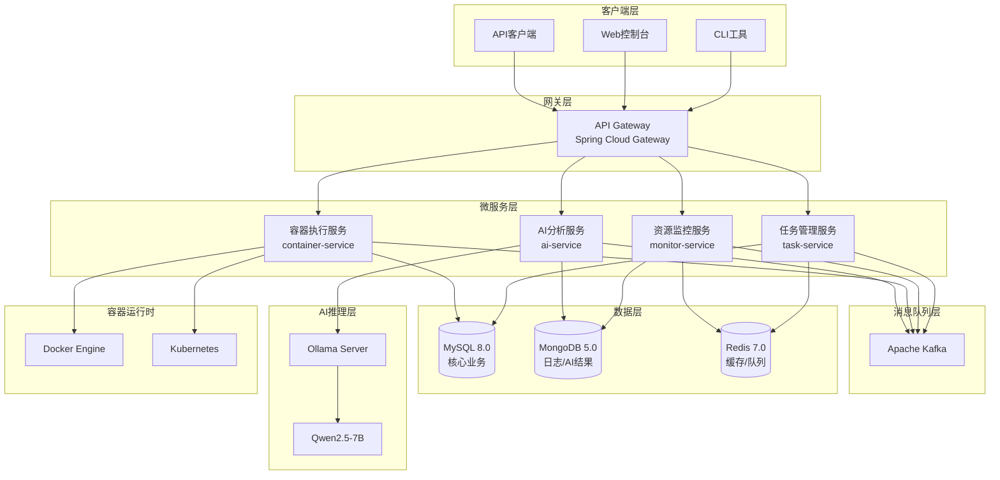
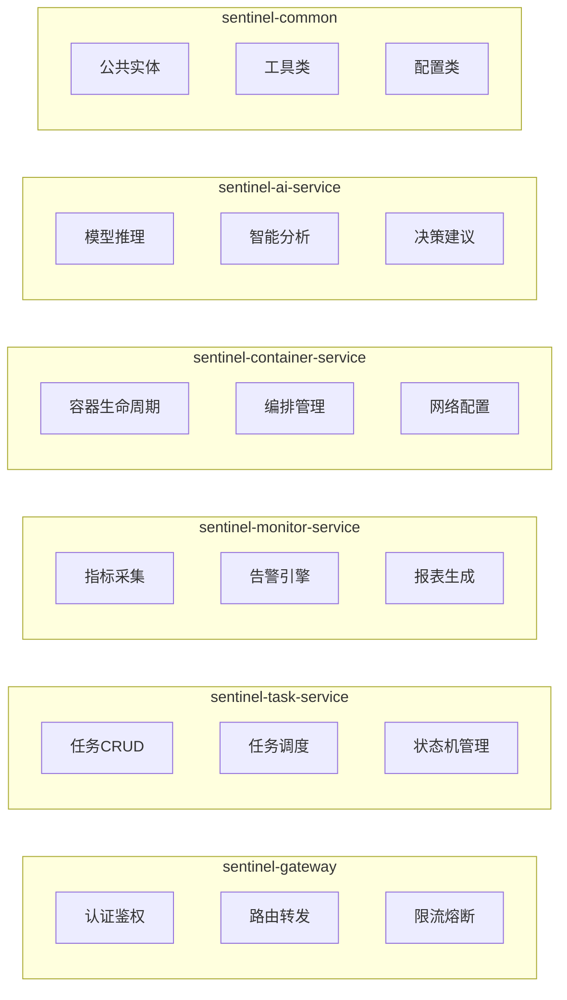
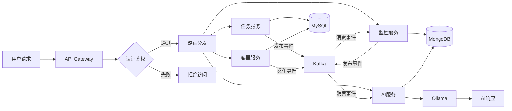

# Sentinel 系统架构设计文档

**项目名称：** Sentinel：面向持续集成的容器化测试环境自适应管理智能体系统

**版本：** v1.0

**日期：** 2025-12-16

---

## 产品概述

Sentinel 是一个智能体系统，采用微服务架构设计，支持任务管理、资源监控、容器执行和AI分析等核心功能。系统基于 Java Spring Boot 技术栈构建，支持私有化部署和云端扩展。

## 核心功能

- **任务管理服务**：智能体任务的创建、调度、执行和状态追踪
- **资源监控服务**：系统资源（CPU、内存、网络、存储）的实时监控和告警
- **容器执行服务**：基于 Docker/K8s 的容器生命周期管理和编排
- **AI分析服务**：集成 Ollama + Qwen2.5-7B 进行智能分析和决策
- **API Gateway**：统一入口、认证鉴权、限流熔断、请求路由
- **消息驱动**：基于 Kafka 的异步通信和事件驱动架构

## 技术栈

### 核心框架

- **编程语言**：Java 17 + Spring Boot 3.2
- **微服务框架**：Spring Cloud 2023.x（Gateway、OpenFeign、LoadBalancer）
- **API文档**：SpringDoc OpenAPI 3.0

### 数据存储

- **关系型数据库**：MySQL 8.0（核心业务数据）
- **文档数据库**：MongoDB 5.0（日志、AI分析结果）
- **缓存/队列**：Redis 7.0（分布式缓存、会话管理）

### 消息队列

- **Kafka 3.x**：高吞吐消息传递、事件溯源、服务解耦

### 容器编排

- **开发环境**：Docker Compose
- **生产环境**：Kubernetes 1.28+

### AI集成

- **推理引擎**：Ollama
- **模型**：Qwen2.5-7B 本地部署

## 架构设计

### 系统架构图



### 微服务模块划分



### 数据流程图



## 模块划分

### 1. sentinel-gateway（API网关）

- **职责**：统一入口、认证授权、限流熔断、请求路由
- **技术**：Spring Cloud Gateway、JWT、Resilience4j
- **依赖**：Redis（令牌缓存）

### 2. sentinel-task-service（任务管理服务）

- **职责**：任务CRUD、任务调度、状态机管理、执行历史
- **技术**：Spring Boot、MyBatis-Plus、Quartz
- **依赖**：MySQL、Redis、Kafka

### 3. sentinel-monitor-service（资源监控服务）

- **职责**：指标采集、阈值告警、趋势分析、报表生成
- **技术**：Spring Boot、Micrometer、Prometheus Client
- **依赖**：MongoDB、Redis、Kafka

### 4. sentinel-container-service（容器执行服务）

- **职责**：容器生命周期管理、镜像管理、网络配置、日志采集
- **技术**：Spring Boot、Docker Java Client、Kubernetes Client
- **依赖**：MySQL、Docker/K8s API

### 5. sentinel-ai-service（AI分析服务）

- **职责**：模型推理、智能分析、决策建议、结果存储
- **技术**：Spring Boot、OkHttp（Ollama API）
- **依赖**：MongoDB、Ollama、Kafka

### 6. sentinel-common（公共模块）

- **职责**：公共实体、工具类、异常处理、配置类
- **技术**：Java 17、Lombok、MapStruct

## 数据流设计

### 同步调用流程

```
Client -> Gateway -> Service -> Database -> Response
```

### 异步事件流程

```
Service -> Kafka Topic -> Consumer Service -> Process -> Store
```

### Kafka Topic 设计

| Topic名称 | 生产者 | 消费者 | 用途 |
| --- | --- | --- | --- |
| task-events | task-service | ai-service, monitor-service | 任务状态变更事件 |
| container-events | container-service | task-service, monitor-service | 容器状态变更事件 |
| monitor-alerts | monitor-service | task-service, ai-service | 监控告警事件 |
| ai-results | ai-service | task-service | AI分析结果事件 |

## 目录结构

```
sentinel/
├── sentinel-gateway/                 # API网关
│   ├── src/main/java/
│   │   └── com/sentinel/gateway/
│   │       ├── config/              # 网关配置
│   │       ├── filter/              # 过滤器
│   │       └── handler/             # 异常处理
│   └── src/main/resources/
│       └── application.yml
├── sentinel-task-service/            # 任务管理服务
│   ├── src/main/java/
│   │   └── com/sentinel/task/
│   │       ├── controller/          # REST控制器
│   │       ├── service/             # 业务逻辑
│   │       ├── repository/          # 数据访问
│   │       ├── entity/              # 实体类
│   │       ├── dto/                 # 数据传输对象
│   │       ├── event/               # 事件定义
│   │       └── statemachine/        # 状态机
│   └── src/main/resources/
├── sentinel-monitor-service/         # 资源监控服务
│   ├── src/main/java/
│   │   └── com/sentinel/monitor/
│   │       ├── controller/
│   │       ├── service/
│   │       ├── collector/           # 指标采集器
│   │       ├── alert/               # 告警引擎
│   │       └── repository/
│   └── src/main/resources/
├── sentinel-container-service/       # 容器执行服务
│   ├── src/main/java/
│   │   └── com/sentinel/container/
│   │       ├── controller/
│   │       ├── service/
│   │       ├── docker/              # Docker客户端
│   │       ├── kubernetes/          # K8s客户端
│   │       └── repository/
│   └── src/main/resources/
├── sentinel-ai-service/              # AI分析服务
│   ├── src/main/java/
│   │   └── com/sentinel/ai/
│   │       ├── controller/
│   │       ├── service/
│   │       ├── client/              # Ollama客户端
│   │       ├── prompt/              # 提示词模板
│   │       └── repository/
│   └── src/main/resources/
├── sentinel-common/                  # 公共模块
│   └── src/main/java/
│       └── com/sentinel/common/
│           ├── entity/              # 公共实体
│           ├── dto/                 # 公共DTO
│           ├── exception/           # 异常定义
│           ├── util/                # 工具类
│           └── config/              # 公共配置
├── docs/                             # 文档目录
│   ├── uml/                         # UML图
│   ├── api/                         # API文档
│   └── architecture/                # 架构文档
├── deploy/                           # 部署配置
│   ├── docker/                      # Docker配置
│   ├── kubernetes/                  # K8s配置
│   └── scripts/                     # 部署脚本
├── docker-compose.yml               # 开发环境编排
├── docker-compose.prod.yml          # 生产环境编排
└── pom.xml                          # Maven父POM
```

## 数据库设计

### MySQL表结构（核心业务）

```sql
-- 任务表
CREATE TABLE t_task (
    id BIGINT PRIMARY KEY AUTO_INCREMENT,
    name VARCHAR(200) NOT NULL,
    description TEXT,
    type VARCHAR(50) NOT NULL,
    status VARCHAR(50) NOT NULL DEFAULT 'PENDING',
    priority INT DEFAULT 0,
    config JSON,
    creator_id BIGINT,
    scheduled_at DATETIME,
    started_at DATETIME,
    completed_at DATETIME,
    created_at DATETIME DEFAULT CURRENT_TIMESTAMP,
    updated_at DATETIME DEFAULT CURRENT_TIMESTAMP ON UPDATE CURRENT_TIMESTAMP,
    INDEX idx_status (status),
    INDEX idx_type (type),
    INDEX idx_creator (creator_id)
);

-- 容器表
CREATE TABLE t_container (
    id BIGINT PRIMARY KEY AUTO_INCREMENT,
    container_id VARCHAR(100) NOT NULL,
    name VARCHAR(200) NOT NULL,
    image VARCHAR(500) NOT NULL,
    status VARCHAR(50) NOT NULL,
    task_id BIGINT,
    config JSON,
    created_at DATETIME DEFAULT CURRENT_TIMESTAMP,
    updated_at DATETIME DEFAULT CURRENT_TIMESTAMP ON UPDATE CURRENT_TIMESTAMP,
    UNIQUE KEY uk_container_id (container_id),
    INDEX idx_task (task_id)
);
```

### MongoDB集合设计（日志/AI结果）

```javascript
// 监控指标集合
db.metrics.createIndex({ "timestamp": -1, "type": 1 });
{
    _id: ObjectId,
    type: "cpu|memory|network|disk",
    value: Number,
    unit: String,
    source: String,
    tags: { host: String, container: String },
    timestamp: ISODate
}

// AI分析结果集合
db.ai_results.createIndex({ "taskId": 1, "createdAt": -1 });
{
    _id: ObjectId,
    taskId: Long,
    prompt: String,
    response: String,
    model: "qwen2.5-7b",
    tokens: { input: Number, output: Number },
    latency: Number,
    createdAt: ISODate
}
```

## 技术考量

### 性能优化

- Redis缓存热点数据（任务状态、用户会话）
- Kafka批量消费提升吞吐
- MongoDB索引优化查询性能
- 连接池配置（HikariCP、Lettuce）

### 安全措施

- JWT令牌认证 + Redis令牌黑名单
- API限流（Resilience4j RateLimiter）
- 敏感配置加密（Jasypt）
- 容器安全策略（非root运行、资源限制）

### 可扩展性

- 微服务无状态设计，支持水平扩展
- Kafka分区支持消费者扩展
- K8s HPA自动伸缩配置

## 开发计划

| 序号 | 任务 | 依赖 |
|------|------|------|
| 1 | 探索现有项目结构 | - |
| 2 | 创建 UML 建模文档 | 1 |
| 3 | 设计数据库 Schema | 2 |
| 4 | 定义 API 接口规范 | 3 |
| 5 | 设计 Kafka 消息规范 | 4 |
| 6 | 创建 Maven 多模块项目结构 | 5 |
| 7 | 编写 Docker Compose 配置 | 6 |
| 8 | 编写 Kubernetes 部署配置 | 7 |
