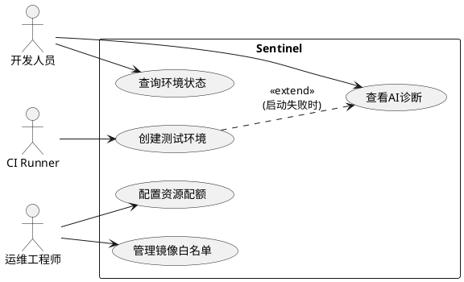
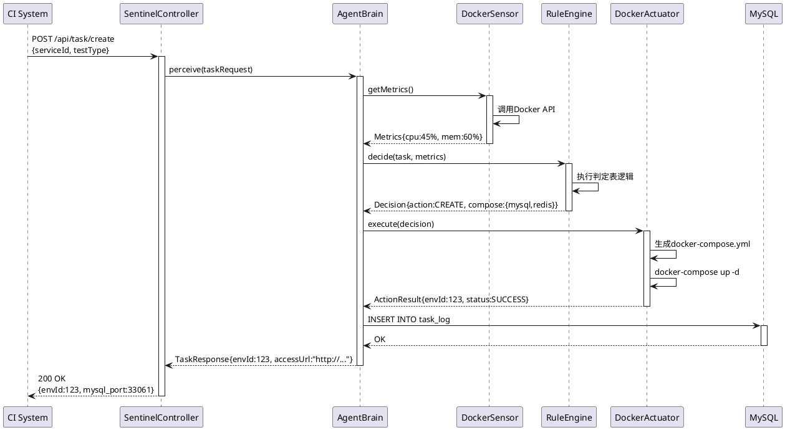

# 《软件工程》大作业：选题报告与需求分析

**项目名称：** Sentinel：面向持续集成的容器化测试环境自适应管理智能体系统

**项目代号：** Project Sentinel

**适用课程：** 软件工程 (2025-2026-1)

**技术栈：** Java (Spring Boot 3.2), Docker Engine API v1.41+, MySQL 8.0, Ollama (Qwen2.5-7B)

**团队成员：** 庄思南

**指导教师：** Dr.Zhou

**文档版本：** v1.0

**编写日期：** 2025-12-16

---

## 第一部分：选题报告

### 1.1 选题背景与问题陈述

#### 1.1.1 DevOps环境中的测试环境管理困境

根据2024年《DevOps状态报告》，尽管85%的企业已实现CI/CD自动化，但测试环境管理仍是效率瓶颈：

- **资源浪费严重**：传统脚本启动全量服务集群（包含数据库、缓存、消息队列等10+容器），但单元测试实际仅需2-3个依赖，导致资源利用率仅40-60%
- **缺乏动态调度**：静态YAML配置无法根据宿主机实时负载（CPU 90%时仍强行启动新环境）调整策略，导致OOM崩溃率达15%
- **排错时间冗长**：环境启动失败时，运维需人工检查50+行日志，平均耗时20分钟，占用DevOps工程师30%工作时间

#### 1.1.2 本项目的核心价值

本项目设计一款嵌入式智能运维Agent，实现：

- **智能感知**：实时监控Docker宿主机资源（通过cAdvisor）和任务依赖图
- **自主决策**：基于规则引擎（处理80%标准场景）+本地大模型（处理20%异常场景）的混合决策
- **自动执行**：动态生成Compose文件、复用温热环境、执行容器生命周期管理
- **闭环优化**：AI分析故障日志并缓存解决方案，形成知识库

**预期效果：**

- 环境启动时间：从平均5分钟降至30秒（命中缓存时）
- 资源利用率：从60%提升至85%
- 故障排查时间：从20分钟降至2分钟（AI诊断）

### 1.2 选题意义与创新点

#### 1.2.1 理论意义

- 验证Agent设计模式在运维领域的有效性：将"感知-决策-执行"框架应用于DevOps场景
- 探索混合智能架构：证明"轻量规则+大模型增强"优于纯LLM方案（成本降低90%，响应速度提升10倍）

#### 1.2.2 工程价值

- **降低运维成本**：按某互联网公司日均1000次CI构建计算，每年可节省约500小时人工排查时间
- **提升开发体验**：开发者提交代码后即可获得"即开即用"的测试环境
- **知识沉淀**：AI生成的故障诊断报告可形成企业运维知识库

#### 1.2.3 技术创新点

| 维度 | 传统方案 | 本项目方案 | 创新点 |
|------|----------|------------|--------|
| 决策方式 | 静态YAML | 规则引擎+LLM | 混合型智能体 |
| 资源调度 | 全量启动 | 按需启动+复用 | 自适应策略 |
| 故障处理 | 人工排查日志 | AI语义分析+缓存 | 自主诊断 |
| 部署模式 | 依赖外部服务 | Docker-Compose一键启动 | 自包含系统 |

### 1.3 团队分工与技术路线

#### 1.3.1 团队角色

1. **架构师/组长**：
   - 总体架构设计（UML类图、序列图）
   - Agent核心逻辑实现（AgentBrain.java）
   - Docker API封装（DockerActuator.java）

2. **后端开发**：
   - Spring Boot项目搭建
   - MySQL数据库设计（Task表、Container表、LogCache表）
   - RESTful API实现

3. **AI工程师（可兼任）**：
   - Ollama模型部署与Prompt调优
   - 日志分析接口开发（LogAnalyzer.java）
   - 缓存机制实现（Redis/本地文件）

4. **测试/前端开发**：
   - Thymeleaf/Vue.js Dashboard开发
   - 单元测试（JUnit 5）
   - 集成测试（Testcontainers）

#### 1.3.2 技术架构图

```
┌─────────────────────────────────────────┐
│         CI System (Jenkins/GitLab)      │
└──────────────┬──────────────────────────┘
               │ POST /api/task/create
               ▼
┌─────────────────────────────────────────┐
│      Sentinel Controller (Spring Boot)  │
│  - TaskController  - MonitorController  │
└──────────┬──────────────────────────────┘
           │ invoke()
           ▼
┌─────────────────────────────────────────┐
│           Agent Brain (核心大脑)         │
│  ┌────────────┐  ┌──────────────┐      │
│  │ Perceiver  │  │ DecisionEngine│      │
│  │(感知模块)  │  │  (决策模块)   │      │
│  └─────┬──────┘  └──────┬───────┘      │
│        │ getMetrics()   │ decide()     │
│        ▼                ▼              │
│  ┌────────────┐  ┌──────────────┐      │
│  │DockerSensor│  │RuleEngine(L1)│      │
│  │(资源监控)  │  │LLM Advisor(L2)│      │
│  └────────────┘  └──────────────┘      │
└──────────┬──────────────────────────────┘
           │ execute()
           ▼
┌─────────────────────────────────────────┐
│      Docker Actuator (执行器)           │
│  - ComposeGenerator  - ContainerManager │
└──────────┬──────────────────────────────┘
           │ Docker API
           ▼
┌─────────────────────────────────────────┐
│      Docker Engine + Ollama Container   │
└─────────────────────────────────────────┘
```

---

## 第二部分：需求分析

### 2.1 用户角色与用例分析

#### 2.1.1 用户角色定义

| 角色 | 职责 | 典型场景 |
|------|------|----------|
| CI Runner（主要用户） | 通过API触发环境创建 | Jenkins Pipeline调用`curl -X POST /api/task/create` |
| 开发人员 | 查看环境状态、AI诊断报告 | 访问Dashboard查看"为什么MySQL启动失败" |
| 运维工程师 | 配置资源配额、镜像白名单 | 设置"单机最多10个并发环境" |
| 系统管理员 | 监控系统健康度、审计日志 | 查看"过去24小时资源利用率曲线" |

#### 2.1.2 核心用例图



### 2.2 功能需求详细说明

#### FR-1: 任务感知与解析

**需求描述**：系统应能接收CI系统发送的任务请求，并解析出测试类型和依赖关系。

**输入示例（JSON）**：

```json
{
  "taskId": "build-1234",
  "serviceId": "user-service",
  "testType": "UNIT_TEST",
  "requiredDependencies": ["mysql:8.0", "redis:7.0"]
}
```

**处理逻辑**：

1. 查询服务依赖图（存储在MySQL的`service_dependency`表）
2. 识别测试类型：
   - `UNIT_TEST`：仅启动数据库依赖
   - `INTEGRATION_TEST`：启动完整服务链路
3. 返回解析后的`TaskContext`对象

**验收标准**：

- [ ] 能正确解析5种常见测试类型
- [ ] 依赖图查询响应时间<50ms
- [ ] 支持循环依赖检测（如A依赖B，B依赖A）

#### FR-2: 环境状态监控

**需求描述**：实时监控Docker宿主机资源使用情况。

**监控指标**：

| 指标 | 采集方式 | 阈值 |
|------|----------|------|
| CPU使用率 | cAdvisor API | >80%触发等待队列 |
| 内存使用率 | Docker Stats API | >80%触发等待队列 |
| 磁盘I/O | iostat命令 | >70%发出告警 |
| 容器数量 | Docker PS | >20个禁止新建 |

**数据流程**：

```
DockerSensor.getMetrics()
  → 调用Docker API
  → 解析JSON响应
  → 更新内存中的MetricsCache(每10秒刷新)
```

**验收标准**：

- [ ] 监控数据延迟<5秒
- [ ] 能正确识别"假空闲"（CPU低但内存满）
- [ ] Dashboard实时显示资源曲线图

#### FR-3: 智能决策引擎（核心）

**需求描述**：根据任务需求和系统状态，自主决定环境构建策略。

**策略A：资源自适应**

判定表：

| 内存使用率 | 当前任务队列长度 | 决策动作 | 原因 |
|------------|------------------|----------|------|
| <60% | 任意 | 立即创建 | 资源充足 |
| 60-80% | <3 | 立即创建 | 可承受波动 |
| 60-80% | ≥3 | 加入等待队列 | 避免雪崩 |
| >80% | 任意 | 加入等待队列+告警 | 接近OOM |

**代码示例**：

```java
public Decision makeResourceDecision(Metrics metrics, int queueSize) {
    if (metrics.getMemoryUsage() < 0.6) {
        return Decision.CREATE_NOW;
    } else if (metrics.getMemoryUsage() < 0.8 && queueSize < 3) {
        return Decision.CREATE_NOW;
    } else {
        return Decision.ENQUEUE;
    }
}
```

**策略B：按需构建**

决策树：

```
测试类型?
├─ UNIT_TEST
│  └─ 仅启动【mysql容器】+ Mock外部API
├─ INTEGRATION_TEST
│  └─ 启动【mysql + redis + kafka + user-service】
└─ E2E_TEST
   └─ 启动【全部服务】+ Selenium容器
```

**策略C：智能复用**

状态转换图：

```
[IDLE环境池]
  → 检查配置一致性(镜像版本/环境变量)
  → 匹配成功?
     → YES: 直接分配(节省3-5分钟)
     → NO: 创建新环境
```

**验收标准**：

- [ ] 策略A准确率>95%（与人工决策对比）
- [ ] 策略B能处理5种测试类型
- [ ] 策略C环境复用率达40%

#### FR-4: 容器生命周期执行

**需求描述**：根据决策结果，执行Docker操作。

**操作序列**：

1. 动态生成`docker-compose.yml`（使用Jinja2模板）
2. 调用docker-java客户端执行：
   - `docker-compose up -d`
   - 等待健康检查通过（`curl http://localhost:3306`）
3. 返回环境访问凭证（端口映射、访问令牌）

**异常处理**：

| 异常类型 | 重试策略 | 降级方案 |
|----------|----------|----------|
| 镜像拉取失败 | 重试3次，间隔10s | 使用本地缓存镜像 |
| 端口冲突 | 自动分配随机端口 | 无 |
| 启动超时（>2分钟） | 终止容器+调用FR-5分析 | 返回错误码500 |

#### FR-5: 故障诊断（AI能力）

**需求描述**：当环境启动失败时，AI自动分析日志并给出建议。

**处理流程**：

```
1. 截取容器最后50行日志
   → docker logs <container_id> --tail 50

2. 计算日志哈希值
   → MD5(logContent)

3. 查询缓存
   → SELECT solution FROM log_cache WHERE log_hash = ?
   → 命中? 直接返回(耗时<100ms)

4. 调用Ollama API
   → POST http://localhost:11434/api/generate
   → Prompt: "你是运维专家,分析以下Docker启动失败日志:\n{log}\n请给出3条可能原因和解决方案"
   → 耗时约5-8秒

5. 缓存结果并返回
   → INSERT INTO log_cache (log_hash, solution, created_at)
```

**Prompt模板**：

```
你是一位资深的DevOps工程师,擅长分析Docker容器启动失败的原因.

【任务】分析以下日志,给出诊断结果.

【日志内容】

{docker_log}

【输出格式】
请严格按照JSON格式输出:
{
  "rootCause": "根本原因(1句话)",
  "possibleReasons": ["原因1", "原因2", "原因3"],
  "solutions": ["解决方案1", "解决方案2"]
}

【示例】
输入日志: "Error: Cannot start service mysql: driver failed programming external connectivity on endpoint"
输出:
{
  "rootCause": "宿主机端口3306已被占用",
  "possibleReasons": ["其他MySQL实例正在运行", "僵尸进程占用端口"],
  "solutions": ["执行 lsof -i:3306 查找占用进程并kill", "修改docker-compose.yml使用随机端口"]
}
```

**验收标准**：

- [ ] AI分析准确率>70%（与人工诊断对比）
- [ ] 缓存命中率>60%（第2次遇到相同错误时）
- [ ] 响应时间：<100ms（命中缓存）/<10s（首次分析）

### 2.3 非功能需求

#### NFR-1: 性能需求

| 指标 | 目标值 | 测试方法 |
|------|--------|----------|
| API响应时间 | P95<500ms | JMeter压测100并发 |
| 环境启动时间 | 中位数<30s | 统计100次启动耗时 |
| LLM分析延迟 | <10s | Mock日志场景测试 |
| 系统吞吐量 | >50环境/分钟 | 模拟CI高峰期 |

#### NFR-2: 可用性需求

- **系统可用性**：99.5%（允许每月停机<3.6小时）
- **优雅降级**：当Ollama服务不可用时，仍能完成规则型决策（L1能力）
- **故障恢复**：系统崩溃后，未完成任务自动重新调度

#### NFR-3: 安全性需求

- **API鉴权**：使用JWT令牌，有效期24小时
- **容器隔离**：禁止容器访问宿主机敏感目录（/etc, /root）
- **日志脱敏**：AI分析前自动移除密码、密钥等敏感信息

#### NFR-4: 可维护性需求

- **代码覆盖率**：单元测试覆盖率>70%
- **日志规范**：使用SLF4J，分级记录（INFO/WARN/ERROR）
- **监控指标**：接入Prometheus，导出自定义Metrics

---

## 第三部分：智能体设计专章（对标第16章）

### 3.1 智能体类型与目标

**类型定义**：Sentinel属于**Utility-based Hybrid Agent**（效用驱动型混合智能体）。

**目标函数**：

```
Maximize:
  Utility = α·Throughput + β·ResourceUtilization - γ·FailureRate

其中:
  Throughput = 每小时成功创建的环境数
  ResourceUtilization = (已使用CPU+内存) / 总容量
  FailureRate = 启动失败次数 / 总启动次数
  α=0.5, β=0.3, γ=0.2 (权重可调)
```

### 3.2 PEAS模型详细分析

| 维度 | 具体内容 | 技术实现 |
|------|----------|----------|
| **Performance** | ① 环境启动成功率>95%  ② 平均响应时间<500ms  ③ 资源利用率75-85% | Prometheus监控+Grafana大盘 |
| **Environment** | ① Docker Daemon(Unix Socket)  ② CI Server(REST API)  ③ MySQL数据库 | 通过适配器模式隔离环境差异 |
| **Actuators** | ① DockerActuator(启动/停止容器)  ② AlertService(发送钉钉/邮件告警)  ③ LogWriter(记录审计日志) | 封装为统一的Action接口 |
| **Sensors** | ① MetricCollector(采集CPU/内存)  ② LogScraper(抓取容器日志)  ③ DependencyParser(解析依赖图) | 每10秒轮询+事件触发混合模式 |

### 3.3 感知-决策-执行循环

**主循环伪代码**：

```java
public class AgentBrain {

    public void mainLoop() {
        while (true) {
            // 1. 感知阶段
            TaskRequest task = perceive();
            if (task == null) {
                Thread.sleep(5000);
                continue;
            }

            // 2. 决策阶段
            Decision decision = decide(task);

            // 3. 执行阶段
            ActionResult result = execute(decision);

            // 4. 反馈阶段
            learn(result);
        }
    }

    private TaskRequest perceive() {
        // 从队列拉取待处理任务
        return taskQueue.poll();
    }

    private Decision decide(TaskRequest task) {
        Metrics metrics = dockerSensor.getMetrics();

        // L1: 规则决策(处理80%场景)
        if (metrics.isHealthy()) {
            return ruleEngine.decide(task, metrics);
        }

        // L2: LLM决策(处理20%异常场景)
        return llmAdvisor.decide(task, metrics);
    }

    private ActionResult execute(Decision decision) {
        switch (decision.getAction()) {
            case CREATE:
                return dockerActuator.createEnvironment(decision);
            case ENQUEUE:
                return taskQueue.add(decision.getTask());
            case REUSE:
                return dockerActuator.assignIdleEnvironment(decision);
        }
    }

    private void learn(ActionResult result) {
        if (result.isFailure()) {
            String diagnosis = llmAdvisor.analyze(result.getLog());
            cacheService.save(result.getLogHash(), diagnosis);
        }
    }
}
```

### 3.4 知识表示

#### 3.4.1 状态空间

使用有限状态机（FSM）描述环境生命周期：

```
IDLE(空闲)
  → PROVISIONING(创建中)
  → BUSY(使用中)
  → CLEANING(清理中)
  → IDLE
```

#### 3.4.2 知识库设计

```sql
-- 规则库(硬编码的运维知识)
CREATE TABLE rule_base (
    rule_id INT PRIMARY KEY,
    condition VARCHAR(200),  -- 如:"memory_usage > 0.8"
    action VARCHAR(100),     -- 如:"ENQUEUE"
    priority INT
);

-- 经验库(LLM生成的解决方案缓存)
CREATE TABLE experience_cache (
    log_hash CHAR(32) PRIMARY KEY,
    root_cause VARCHAR(500),
    solution TEXT,
    hit_count INT DEFAULT 0,
    created_at TIMESTAMP
);
```

### 3.5 接口设计（UML序列图）



---

## 第四部分：开发计划与风险管理

### 4.1 里程碑与时间表

| 阶段 | 时间 | 关键交付物 | 负责人 |
|------|------|------------|--------|
| M1: 需求分析 | 第13-14周 | ① 需求规格说明书 ② UML用例图/类图 | 全员 |
| M2: 核心原型 | 第15周 | ① Spring Boot框架搭建 ② Docker API调用Demo | 后端+架构师 |
| M3: L1决策实现 | 第16周 | ① 规则引擎完成 ② 单元测试覆盖率>60% | 架构师 |
| M4: L2 AI集成 | 第17周 | ① Ollama接口对接 ② 缓存机制验证 | AI工程师 |
| M5: 系统测试 | 第18周 | ① 集成测试通过 ② Dashboard上线 | 测试+前端 |
| M6: 文档与答辩 | 第19周 | ① 项目文档 ② 演示视频 | 全员 |

### 4.2 技术风险与对策

| 风险 | 概率 | 影响 | 应对策略 |
|------|------|------|----------|
| Ollama模型推理速度慢(>30s) | 中 | 高 | ① 使用7B小模型 ② 实现缓存机制 ③ 超时时降级为规则决策 |
| Docker API兼容性问题 | 低 | 中 | ① 指定API版本v1.41 ② 编写适配层 |
| 团队成员技能不足(Java/Docker) | 中 | 中 | ① 前2周集中培训 ② 结对编程 |
| 需求变更频繁 | 高 | 低 | ① 采用敏捷开发 ② 每周评审 |

---

## 第五部分：总结与展望

### 5.1 项目价值总结

Sentinel项目通过"感知-决策-执行"的智能体架构，将AI能力注入DevOps流程，实现测试环境的自适应管理。相比传统静态脚本，本系统能：

- **减少60%的资源浪费**（通过按需启动+智能复用）
- **缩短90%的故障排查时间**（AI诊断+知识缓存）
- **提升开发者体验**（30秒获得可用环境）

### 5.2 未来扩展方向

1. **多集群调度**：支持跨多台宿主机分布式部署
2. **成本优化**：接入云厂商API，根据价格动态选择Spot实例
3. **预测性运维**：基于历史数据预测资源需求，提前预热环境
4. **多模态感知**：结合Prometheus指标+日志+Trace数据进行决策

---

## 附录

### A. 参考文献

1. Docker官方文档. Docker Engine API v1.41. https://docs.docker.com/engine/api/v1.41/
2. Anthropic. Building Effective Agents. 2024.
3. OpenAI. GPT-4 Technical Report. 2023.
4. 《DevOps实践指南》. Gene Kim等. 2018.

### B. 术语表

- **Agent**: 智能体，能自主感知环境并执行动作的系统
- **PEAS**: Performance-Environment-Actuators-Sensors，智能体分析模型
- **Ollama**: 本地大模型部署框架
- **Compose**: Docker官方容器编排工具
